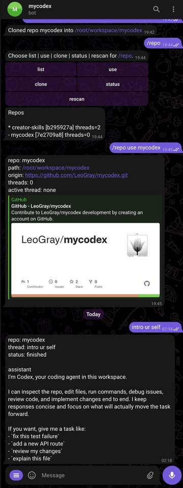

# MyCodex

**Language:** English | [简体中文](./README.zh-CN.md)

Run Codex on a server you control, then keep working from your Mac, Telegram, or your phone.

I built MyCodex because I wanted Codex to stay on my own machine or VPS while I moved between devices. One workspace can hold multiple Git repositories. Each repo stays isolated, and each repo can have multiple threads.

The macOS app is still in progress. The goal is simple: code on the Mac when I am at the desk, then keep the same task going from Telegram or another paired client when I step away.



The Telegram side already works like this: start a thread, approve a sensitive command in chat, and get the result back in the same place.

## What It Does Today

- Keep multiple repos in one workspace without mixing their Codex state
- Let one repo have multiple threads
- Keep Telegram threads and app threads separate
- Send command and patch approvals back to the place where the run started
- Make it practical to work on the Mac first and continue from the phone later

## Quick Start

You need these first:

- a working `codex` CLI
- Codex auth or `OPENAI_API_KEY`
- `git`
- a Telegram bot token if you want Telegram

Official one-line install for x86_64 Linux:

```bash
curl -fsSL https://raw.githubusercontent.com/LeoGray/mycodex/main/public/install.sh | bash
/usr/local/bin/mycodex onboard
```

Source install for Linux or macOS:

```bash
git clone https://github.com/LeoGray/mycodex.git
cd mycodex
./scripts/install.sh --install-service
/usr/local/bin/mycodex onboard
```

`onboard` will:

- optionally validate the Telegram bot token
- ask where your workspace should live
- optionally store `OPENAI_API_KEY`
- optionally enable the remote app gateway
- optionally enable the installed service

## macOS App Modes

- Client mode: start only the app client and connect to a remote MyCodex server
- Server mode: start only the MyCodex server on a Mac and let other devices pair to it
- Hybrid mode: start server and client together on the same Mac so you can code locally, then keep controlling that machine from your phone when you step away

A few macOS notes:

- Local Host stores its generated `config.toml`, state, workspace, and logs under the app-owned data directory instead of the system install paths
- Local Host can run with Telegram disabled; the app gateway and Codex runtime still work
- Local Host networking is explicit: `Local only` binds to `127.0.0.1`, and `Allow LAN devices` binds to `0.0.0.0` and exposes a LAN URL for phone pairing

## How I Use It

1. Start MyCodex on your Mac in hybrid mode.
2. Work locally in the desktop app against a repo inside your workspace.
3. Leave your Mac and continue the same task from your phone through Telegram or another paired app.
4. Repo isolation, thread state, and approvals stay attached to the surface that started them.

## Repository Layout

- `apps/server`: Rust daemon, Telegram adapter, app gateway, and CLI
- `apps/desktop`: Tauri + React client shell for desktop, Android, and iOS
- `config`: example configuration
- `deploy`: service definitions
- `scripts`: install and packaging helpers

## Command Menu

Basic:

- `/start`
- `/status`
- `/abort`

Repo:

- `/repo list`
- `/repo use <name>`
- `/repo clone <git_url> [dir_name]`
- `/repo status`
- `/repo rescan`

Thread:

- `/thread list`
- `/thread new`
- `/thread use <thread>`
- `/thread status`

Plain text messages are always sent to the active thread of the active repo.

## Mental Model

- `workspace`: a directory that contains first-level repos
- `repo`: the isolation boundary
- `thread`: a Codex conversation inside one repo
- `surface`: where you are talking to MyCodex, currently `telegram` or `app`

Switching repos does not reuse another repo's runtime context.
Telegram threads and app threads do not appear in each other's thread lists.

Telegram access mode is `pairing` by default.
First-time Telegram flow:

1. Install MyCodex
2. Run `/usr/local/bin/mycodex onboard`
3. Send a message to the bot
4. Get a pairing code
5. Approve it on the server with `/usr/local/bin/mycodex pairing approve <CODE>`

App flow:

1. Enable the app gateway during `onboard`, or set `app.enabled = true`
2. Start the daemon
3. Open the app on desktop or mobile and request a pairing code
4. Approve it on the server with `/usr/local/bin/mycodex app pairing approve <CODE>`
5. Connect the app with the issued bearer token

Desktop app tabs:

- `Workbench`: primary workspace, repo, thread, and composer flow
- `Settings`: server URL, token, pairing, device label, and diagnostics
- `Host`: desktop-only local server lifecycle, LAN mode, config paths, and logs

## Config

Start from [config/config.example.toml](./config/config.example.toml).

Most important keys:

- `workspace.root`
- `telegram.bot_token`
- `telegram.access_mode`
- `app.enabled`
- `app.bind_addr`
- `app.public_base_url`
- `codex.bin`
- `state.dir`

Default paths:

- Linux
  - config: `/etc/mycodex/config.toml`
  - env: `/etc/mycodex/mycodex.env`
  - service: `/etc/systemd/system/mycodex.service`
  - state: `/var/lib/mycodex`
- macOS
  - config: `$HOME/.config/mycodex/config.toml`
  - env: `$HOME/.config/mycodex/mycodex.env`
  - service: `$HOME/Library/LaunchAgents/com.leogray.mycodex.plist`
  - state: `$HOME/.local/state/mycodex`

## Packaging

- [public/install.sh](./public/install.sh) is the official prebuilt installer and defaults to `x86_64-unknown-linux-musl`
- [scripts/install.sh](./scripts/install.sh) builds from local source and supports Linux and macOS
- If you build your own archive, you can still use `public/install.sh --asset-url <URL>`
- Manual packaging uses [scripts/package-release.sh](./scripts/package-release.sh)

Examples:

```bash
./scripts/package-release.sh --target x86_64-unknown-linux-musl
./scripts/package-release.sh --target aarch64-apple-darwin
```

CI runs on Linux and macOS.
The official release workflow publishes one Linux artifact: `mycodex-x86_64-unknown-linux-musl.tar.gz`.

## Development

```bash
cargo build --release
cargo test
```

Client shell:

```bash
cd apps/desktop
npm install
npm run tauri:dev
```

Mobile shells:

```bash
cd apps/desktop
npm run tauri:android:dev
npm run tauri:android:build
npm run tauri:ios:dev
npm run tauri:ios:build
```

Notes:

- The generated Android and iOS host projects live under `apps/desktop/src-tauri/gen/android` and `apps/desktop/src-tauri/gen/apple`
- Android builds allow HTTP and WebSocket connections to a LAN daemon URL so local-device testing works without TLS
- iOS signing assets are not committed; each developer signs with their own Apple account when building locally

The desktop shell talks to the daemon over:

- `POST /api/app/pairings/request`
- `GET /api/app/pairings/{pairing_id}`
- authenticated WebSocket `/ws?token=...`

For manual Linux service setup, use [deploy/systemd/mycodex.service](./deploy/systemd/mycodex.service) as a starting point.
